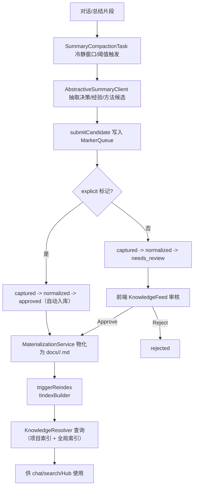
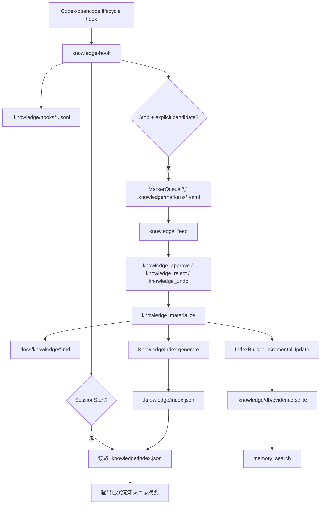

# 知识治理功能：从提取候选到可检索沉淀

> Scope: 记录项目内“知识治理”功能（知识抽取、候选管理、审核、沉淀、回流、治理回放）

## 一句话结论

本项目的知识治理本质上是“**先提取后治理**”：对话摘要会先生成候选（marker），再经过审核/状态流转决定是否物化为 `.md` 真相源并编入检索索引，最终通过 UI 与 API 形成可追踪的治理闭环。

## 设计目标

1. 防止噪音知识污染：抽取结果不直接进入检索真相源。
2. 保证可追溯：每条知识候选有状态、来源、变更历史。
3. 可回放：知识来源可还原到 `docs/markers/*.yaml`，重建可重复。
4. 兼容两级治理：项目级治理（Marker）与发布级治理（`/api/memory/publish`）。
5. 与检索协同：知识最终落盘后才纳入 `evidence` 检索。

## 流程总览



## 核心实现组件

### 1) 候选抽取与筛选

- `SummaryCompactionTask`：负责在静默窗口内检测并压缩对话，决定是否需要抽取摘要候选。
- `AbstractiveSummaryClient`：通过 LLM 生成自然语言再解析标签（如 `decision/lesson/method`），并做噪声过滤。
- 通过配置 `F102_DURABLE_CANDIDATES=on` 开启 durable 候选；否则仍走轻量路径。
- 候选会被 `submitCandidate` 写入持久队列。

### 2) Marker 持久化（治理真相源）

- `MarkerQueue` 的真相来源于 `docs/markers/*.yaml`（Git 跟踪）。
- 变更经过提交、更新状态，不依赖重建过程保留。
- 状态机核心链路：`captured -> normalized -> approved/rejected -> materialized -> indexed`。
- 幂等策略：`content`/`marker id` 重复检查，避免重复写入。

### 3) 审核闭环（人工治理）

- `GET /api/knowledge/feed`：按 `needsReview/settled/rejected` 聚合展示候选。
- `POST /api/knowledge/approve`、`POST /api/knowledge/reject`、`POST /api/knowledge/undo`：可操作治理动作。
- `GET /api/knowledge/stats`：全局统计与状态分布。
- 这组接口驱动 `packages/web/src/components/memory/MemoryHub.tsx` 和 `workspace/KnowledgeFeed.tsx`。

### 4) 物化与索引

- `MaterializationService` 负责将 `approved` marker 转成标准化 `docs/<kind>/<markerId>.md`。
- 该 `.md` 写入前含 frontmatter，成为检索的可审计真实来源。
- 紧接着触发 `reindex`，更新项目 `evidence.sqlite`。
- `IndexBuilder` 负责增量/全量构建索引；检索层通过 `KnowledgeResolver` 做项目/全局联合（RRF 融合）。

### 5) 全局知识与发布治理分离

- `GlobalIndexBuilder` 与 `globalStore` 提供跨项目 `global_knowledge.sqlite`（全局知识层）。
- `MemoryGovernanceStore` + `/api/memory/publish` 维护 `draft / pending_review / published / archived`。
- 两条链路并行：
  - Marker-based：项目内可检索知识资产（偏“候选-审批-沉淀”）。
  - Memory publish governance：面向发布状态的知识对象发布流（偏“编辑-发布-归档”）。

### 6) 回填与自动恢复

- 在服务启动时，支持把历史 `summary_segments` 重放为 marker 候选（backfill）。
- 该回填具备幂等保护，避免把历史内容重复提交。

### 7) 前端触达

- `/api/governance/*` 与 `/api/governance/status` 解决外部项目治理状态检测（与 F070 联动）。
- `ProjectSetupCard` 与 `BootstrapOrchestrator` 在首次派遣/新项目场景完成引导。
- `KnowledgeHub`/`KnowledgeFeed` 提供“待审-已审-已拒”操作与统计。

## 关键治理规则（可审计项）

1. 治理前置：`explicit` 标注（可疑程度高）可提升为预审批或自动进入 `approved`。
2. 未经批准不得物化：保证只将受控知识写入检索真相源。
3. 重建是派生物：索引文件（sqlite）可重建，不能代替 marker 的真相。
4. 审核可逆：支持 `undo`，避免误审核导致永久污染。
5. 回流可控：未显式泛化或审核的内容不应直接进全局层。

## 与对话调用链的耦合点（简述）

- `callback-memory-routes.ts`、`evidence.ts` 与路由层统一使用内存服务接口。
- `memory-publish.ts` 处理发布治理状态。
- `index.ts` 为服务启动与运行时配置提供初始化：
  - 可选开启 durable candidates；
  - 回填历史 markers；
  - 注册 evidence/知识路由与发布路由。

## Feature Doc 格式治理与机器索引

### 研究问题/目标

本节回答两个容易混在一起的问题：Feature Doc 的格式是谁规定的、由什么 prompt/规范驱动；以及 `docs/features/index.json` 后续由谁消费、怎么消费、是否作为优先真相源。

结论先行：Feature Doc 格式不是某个单独 prompt 临时生成的，而是由 `feat-lifecycle` skill、标准模板和审计脚本共同约束；`docs/features/index.json` 是脚本派生的机器索引，主要用于一致性校验和可审计快照，运行时 `feat-index` 查询链路优先解析 `docs/features/*.md`，再用 `docs/ROADMAP.md` 兜底。

### 快速导读

- 是啥：Feature Doc 是 feature 生命周期的温层真相源，`index.json` 是从这些 `.md` 文件生成的轻量机器索引。
- 怎么用：新增或更新 feature 文档后，运行 `node scripts/generate-feature-index.mjs` 重新生成 `docs/features/index.json`。
- 何时使用：feature 立项、进度同步、Agent 查 feature、CI/脚本校验 feature/backlog 一致性时使用。
- 为何如此：Markdown 保持人类可审计，脚本索引保持机器可比对，API 查询保持运行时可用。
- 一句话总结：`docs/features/*.md` 是真相，`index.json` 是派生快照，`feat-index` 工具消费的是服务端解析后的 Feature Index Entry。

### 文档格式是怎么生成的

**结论**：Feature Doc 的格式由 `cat-cafe-skills/feat-lifecycle/SKILL.md` 的立项流程驱动，要求从 `cat-cafe-skills/refs/feature-doc-template.md` 复制模板正文，并保留 parser 所需字段。  
**置信度**：`【有明确证据支撑】`  
**依据/推断逻辑**：`feat-lifecycle` 在 Step 2 明确要求“从标准模板创建”，并说明 Frontmatter、Status 行、Why、What、AC、Dependencies 必须保留；模板文件明确写出 Dashboard parser 依赖这些结构。  
**解释深度**：`[机制性]`  
**概念定位**：Feature Doc 是 Feature 生命周期中的温层真相源，连接 ROADMAP 热层和 discussion/research/plans 冷层。  
**流程节点**：立项输入 -> 模板复制/占位替换 -> Feature Doc 落盘 -> parser/audit 可读取。  
**关联结论**：前置依赖“立项流程加载 feat-lifecycle skill”；并行互补“审计脚本检查格式”；后续影响“API 和 Dashboard 能稳定解析字段”。  
**边界条件**：只有按模板保留关键结构时成立；轻量 Feature 可省略 Timeline/Review Gate/Links/Key Decisions，但不能省略最低字段。

**结论**：这里没有发现一个单独的“把文档写成这种格式”的 runtime prompt；更准确地说，格式要求来自 Skill 指令、模板正文和自动审计规则的组合。  
**置信度**：`【有明确证据支撑】`  
**依据/推断逻辑**：`feat-lifecycle` 是执行阶段的指令入口，`feature-doc-template.md` 是结构模板，`scripts/audit-feature-doc-template.mjs` 是校验入口；三者共同覆盖“怎么写”和“怎么判定合格”。  
**解释深度**：`[结构性]`  
**概念定位**：这些文件共同组成文档治理的“生成规范层”。  
**流程节点**：Skill 触发 -> 模板约束 -> 文档提交 -> 审计脚本检查。  
**关联结论**：前置依赖“Agent 使用 feat-lifecycle”；并行互补“人工写作规范和机器审计”；后续影响“格式漂移会被 audit 或 parser 使用方暴露”。  
**边界条件**：如果绕开 skill 手写文档，格式仍可人工满足，但不会自动获得模板流程保护。

**结论**：审计脚本把格式要求固化为检查项，而不是只停留在写作建议。  
**置信度**：`【有明确证据支撑】`  
**依据/推断逻辑**：`scripts/audit-feature-doc-template.mjs` 的 `CHECKS` 覆盖 `frontmatter.feature_ids`、`related_features`、`topics`、`doc_kind`、`created`、Status 行、Why、What、Acceptance Criteria、Dependencies、AC 格式、Dependency tags、Risk。  
**解释深度**：`[机制性]`  
**概念定位**：审计脚本是 Feature Doc 治理中的机器验收层。  
**流程节点**：读取 `docs/features/F*.md` -> 检查字段/章节/正则格式 -> 生成审计报告。  
**关联结论**：前置依赖“Feature Doc 已落盘”；并行互补“模板给正例，审计给反例”；后续影响“格式债务可以被量化治理”。  
**边界条件**：审计脚本检查的是模板基线，不等同于业务完整性证明。

### `index.json` 是怎么生成的

**结论**：`docs/features/index.json` 由 `scripts/generate-feature-index.mjs` 扫描 `docs/features/F*.md` 生成，不应手写维护。  
**置信度**：`【有明确证据支撑】`  
**依据/推断逻辑**：脚本默认 `featuresDir=docs/features`、`outputPath=docs/features/index.json`，逐个读取 feature markdown，解析 frontmatter 中的 `feature_ids`、正文标题和 Status 行，输出 `{ features, generated_at }`。  
**解释深度**：`[机制性]`  
**概念定位**：`index.json` 是 Feature Doc 真相源的机器派生物。  
**流程节点**：Feature Doc 变更 -> generator 扫描 -> JSON 快照更新 -> truth check 可比对。  
**关联结论**：前置依赖“Feature Doc 格式可解析”；并行互补“check-feature-truth 校验新旧索引一致”；后续影响“遗漏运行生成脚本会造成 stale index”。  
**边界条件**：脚本只生成轻量字段 `id/name/status/file`，不承载完整 feature 内容。

生成命令：

```bash
node scripts/generate-feature-index.mjs
```

可选指定输入/输出：

```bash
node scripts/generate-feature-index.mjs --features-dir docs/features --output docs/features/index.json
```

### `index.json` 后面是谁消费、怎么消费

**结论**：运行时的 `feat-index` 查询消费者不是直接读取 `docs/features/index.json`，而是通过 API 读取服务端解析出的 Feature Index Entry。  
**置信度**：`【有明确证据支撑】`  
**依据/推断逻辑**：`packages/api/src/routes/callbacks.ts` 的 `/api/callbacks/feat-index` 调用 `readFeatIndexEntries()`；`readFeatIndexEntries()` 在 `packages/api/src/routes/feat-index-doc-import.ts` 中扫描 `docs/features/*.md`，并读取 `docs/ROADMAP.md` 作为兜底合并来源。  
**解释深度**：`[机制性]`  
**概念定位**：`feat-index` 是 Agent 查询 feature 状态的运行时工具入口。  
**流程节点**：Agent 看到工具说明 -> MCP server 调 `/api/callbacks/feat-index` -> API 解析 Feature Docs/ROADMAP -> 返回 `featId/name/status/keyDecisions/threadIds`。  
**关联结论**：前置依赖“MCP prompt 注入工具说明”；并行互补“index.json 供脚本校验”；后续影响“Agent 查 feature 时拿到的是服务端聚合结果”。  
**边界条件**：测试或注入场景可通过 `featIndexProvider` 替换默认读取逻辑；默认生产路径仍走 `readFeatIndexEntries()`。

**结论**：Agent 被提示使用的是 `feat-index` 工具，而不是被提示“优先读取 index.json”。  
**置信度**：`【有明确证据支撑】`  
**依据/推断逻辑**：`McpPromptInjector.ts` 的注入文本列出“检索 feature: feat-index + featId/query”；`packages/mcp-server/src/tools/callback-tools.ts` 的 `handleFeatIndex` 把工具调用转成 `/api/callbacks/feat-index` 请求；`cat-cafe-skills/refs/mcp-callbacks.md` 记录了相同 HTTP 用法。  
**解释深度**：`[机制性]`  
**概念定位**：这是 Agent 工具发现和调用层，不是文档生成层。  
**流程节点**：Prompt 注入 -> Agent 调工具 -> MCP callback -> API route -> doc import parser。  
**关联结论**：前置依赖“callback credentials 可用”；并行互补“Feature Doc parser”；后续影响“查询行为由 API 过滤 `featId/query/limit` 控制”。  
**边界条件**：如果 Agent 不走 MCP 工具而直接读仓库文件，则需要遵守 `docs/features/*.md` 为真相源、`index.json` 为派生物的约定。

### 运行时消费路径为什么这么设计（澄清）

**核心结论**：`feat-index` 目的是给对话运行时提供“尽量接近当前真实状态”的 feature 查询；因此它不走静态快照文件，而走服务端解析层。

- 为什么不用 `docs/features/index.json` 直接读：  
  - `index.json` 是批处理脚本导出的**派生快照**，天然可能存在 `docs/features` 或 `ROADMAP.md` 的短时不一致；  
  - 直接读取快照会放弃线程关联上下文和状态降级逻辑。
- 走 `/api/callbacks/feat-index` 的收益：  
  - 统一入口受权限和 invocation 边界保护；  
  - 在服务端可按 `featId`/`query`/`limit` 做过滤与分页；  
  - 从 `docs/features/*.md` 与 `docs/ROADMAP.md` 实时合并，`threadIds` 也在返回里统一补齐（便于回溯）。
- 对应调用链：  
  - 前端/MCP 工具看到 `feat-index` 能力说明  
  - 工具走 `callback-tools` 转发请求到 `/api/callbacks/feat-index?invocationId=...&featId=...`  
  - API 侧 `readFeatIndexEntries()` 解析 docs/ROADMAP 并返回 Feature Index Entry  
  - 返回体用于交互端显示、回溯定位（threadIds）与后续决策。

也就是说：**`docs/features/index.json` 不是“运行时主入口”，而是用于离线校验和派生索引审计的输入产物；运行时主入口是 `feat-index` API 的解析结果**。

**结论**：`index.json` 当前最明确的消费者是脚本校验链路，尤其是 `scripts/check-feature-truth.mjs`。  
**置信度**：`【有明确证据支撑】`  
**依据/推断逻辑**：`check-feature-truth` 会先用 generator 生成临时 fresh index，再读取当前 `docs/features/index.json`，比较 `features` 数组是否一致；不一致时报错提示运行 `node scripts/generate-feature-index.mjs`。  
**解释深度**：`[机制性]`  
**概念定位**：`index.json` 是文档治理中的一致性检查对象。  
**流程节点**：生成临时索引 -> 读取仓库索引 -> deepEqual 比对 -> 报告 stale 或 PASS。  
**关联结论**：前置依赖“generator 可运行”；并行互补“ROADMAP active feature 检查”；后续影响“PR/本地检查能发现索引没有同步”。  
**边界条件**：这证明 `index.json` 被脚本消费，不证明它是运行时 API 的主输入。

### 优先级与数据流

```mermaid
flowchart TD
  A[cat-cafe-skills/feat-lifecycle/SKILL.md] --> B[复制 feature-doc-template.md]
  B --> C[docs/features/Fxxx.md]
  C --> D[generate-feature-index.mjs]
  D --> E[docs/features/index.json]
  E --> F[check-feature-truth.mjs stale 校验]
  C --> G[readFeatIndexEntries]
  H[docs/ROADMAP.md] --> G
  G --> I[/api/callbacks/feat-index]
  J[McpPromptInjector: feat-index 工具提示] --> K[MCP handleFeatIndex]
  K --> I
  I --> L[Agent/协作工具获得 featId/name/status/threadIds]
```

默认优先级：

| 场景 | 优先真相源 | 辅助/派生物 | 说明 |
| --- | --- | --- | --- |
| 写 Feature Doc | `feature-doc-template.md` + `feat-lifecycle` skill | `audit-feature-doc-template.mjs` | Skill/模板规定怎么写，审计脚本验证结构 |
| 生成机器索引 | `docs/features/F*.md` | `docs/features/index.json` | JSON 由脚本生成 |
| 校验索引是否过期 | fresh generated index | 当前 `docs/features/index.json` | `check-feature-truth` 比对两者 |
| Agent 查询 feature | `readFeatIndexEntries()` 解析结果 | `docs/ROADMAP.md` 兜底，`threadIds` 补充 | 默认不直接读 `index.json` |
| 人工审计 | Feature Doc 原文 | `index.json` 快照 | 原文可追溯，JSON 便于快速扫描 |

### 决策地图

| 决策点 | 选项 A | 适用场景 | 选项 B | 适用场景 | 决策依据 |
| --- | --- | --- | --- | --- | --- |
| Feature 状态应该从哪里读 | 解析 `docs/features/*.md` | 运行时查询、需要较新语义字段 | 读 `index.json` | 轻量离线扫描或脚本比对 | 默认路径选 A，因为 `.md` 是真相源 |
| `index.json` 是否手写 | 不手写，脚本生成 | 日常维护 | 手工修 JSON | 仅调试临时验证，不应提交 | 防止派生物和真相源分叉 |
| 文档格式靠什么保证 | Skill + 模板 + audit | 正常立项/治理 | 人工自由写 | 临时 note 或非 feature doc | Parser 依赖固定结构 |
| Agent 如何查 feature | 调 `feat-index` 工具 | 协作/回调环境可用 | 直接读仓库 | 本地分析、无回调凭证 | 工具路径会统一过滤和补 threadIds |

### 证据-系统映射表

| 系统模块 | 流程节点 | 关键结论 | 支撑证据 | 置信度 |
| --- | --- | --- | --- | --- |
| Feature 生命周期 Skill | 立项 -> 文档创建 | 格式由 skill 要求从模板创建 | `cat-cafe-skills/feat-lifecycle/SKILL.md` Step 2 | `【有明确证据支撑】` |
| Feature Doc 模板 | 模板复制 -> parser 可读 | Frontmatter/Status/AC/Dependencies 是硬性格式 | `cat-cafe-skills/refs/feature-doc-template.md` “格式要求（Parser 依赖）” | `【有明确证据支撑】` |
| 格式审计脚本 | 文档落盘 -> 结构审计 | 格式要求被固化成检查项 | `scripts/audit-feature-doc-template.mjs` `CHECKS` | `【有明确证据支撑】` |
| 索引生成脚本 | Feature Docs -> JSON | `index.json` 是派生物 | `scripts/generate-feature-index.mjs` `runCli()` | `【有明确证据支撑】` |
| 真相校验脚本 | Fresh index -> 当前 index | stale index 会被检测 | `scripts/check-feature-truth.mjs` `[index-sync]` | `【有明确证据支撑】` |
| API Feature Index Import | docs/ROADMAP -> entries | 运行时默认读 Markdown 和 ROADMAP | `packages/api/src/routes/feat-index-doc-import.ts` `readFeatIndexEntries()` | `【有明确证据支撑】` |
| Callback API | entries -> Agent response | `/api/callbacks/feat-index` 支持 `featId/query/limit` 并补 `threadIds` | `packages/api/src/routes/callbacks.ts` `/api/callbacks/feat-index` | `【有明确证据支撑】` |
| MCP Prompt/Tool | Prompt -> callback request | Agent 被提示用 `feat-index` 工具，不是读 JSON 文件 | `McpPromptInjector.ts`、`callback-tools.ts`、`mcp-callbacks.md` | `【有明确证据支撑】` |

### 认知升级声明

- **结构洞察**：Feature 文档治理不是“写一篇 Markdown”，而是“Skill 生成规范 + Markdown 真相源 + JSON 派生快照 + API 解析消费”的复合结构。
- **因果洞察**：`index.json` 需要同步并非因为 prompt 要求手写它，而是因为生成脚本和 stale 校验把它定义为可比较的派生索引。
- **权衡洞察**：人类可读真相源与机器快速索引存在结构性张力；本项目选择 Markdown 承载真相、JSON 承载快照、API 承载运行时消费。
- **边界洞察**：直接读 `index.json` 只适合轻量离线扫描；涉及最新状态、ROADMAP 兜底或 thread 关联时，应走 `feat-index` API 或 `readFeatIndexEntries()`。

## 公共知识治理能力抽取（opencode/Codex 可复用）

### 研究问题/目标

本节记录 2026-04-30 将知识治理从 Clowder 内部 API 抽成公共能力的实际开发结果。目标不是复制 Clowder 的完整 Hub/UI，而是把可复用的治理闭环沉到 `packages/memory-mcp`：候选捕获、审核、物化、索引、目录 read model、生命周期 hook runner。

关键边界：公共能力复用现有 `memory-mcp` 的 `SqliteEvidenceStore`、`MarkdownScanner`、`IndexBuilder`，新增 governance 层；opencode/Codex 通过 MCP 和 hook 接入，不依赖 Clowder Fastify API、cat registry 或 Web UI。

### 快速导读

- 是啥：`@cat-cafe/memory-mcp` 现在不仅能搜索 Markdown，还能做本地知识治理。
- 怎么用：MCP 工具负责 `capture -> approve/reject/undo -> materialize -> reindex -> index sync`。
- 何时使用：opencode/Codex 等 CLI agent 想在任意项目里做“先候选、后审核、再沉淀”的知识治理时。
- 为何如此：MCP 是跨 agent 公共接口；hook 是生命周期触发层；Markdown/YAML/JSON/SQLite 分别承担真相源、候选队列、目录 read model、检索索引。
- 一句话总结：公共能力版本把 F102 的治理原则落成一个可移植包，而不是继续绑定 Clowder 专用路由。

### 已实现模块

**结论**：公共能力首版落在 `packages/memory-mcp`，复用了搜索底座，只新增治理层。  
**置信度**：`【有明确证据支撑】`  
**依据/推断逻辑**：新增 `src/governance/MarkerQueue.ts`、`MaterializationService.ts`、`KnowledgeIndex.ts`、`src/tools/knowledge.ts`、`src/hooks/knowledge-hook.ts`；`src/factory.ts` 继续装配 `SqliteEvidenceStore`、`MarkdownScanner`、`IndexBuilder`。  
**解释深度**：`[机制性]`  
**概念定位**：公共治理层是 F102 在独立 MCP 包中的可移植实现。  
**流程节点**：MCP/hook 输入 -> MarkerQueue 候选 -> MaterializationService 写 Markdown -> IndexBuilder reindex -> KnowledgeIndex read model。  
**关联结论**：前置依赖 `memory-mcp` 已有索引/搜索能力；并行互补 hook runner；后续影响 opencode/Codex 可接同一套治理能力。  
**边界条件**：首版不包含 Web UI，也不自动调用 LLM 做隐式抽取。

新增文件与职责：

| 文件 | 职责 |
| --- | --- |
| `packages/memory-mcp/src/governance/MarkerQueue.ts` | YAML-backed 本地候选队列 |
| `packages/memory-mcp/src/governance/MaterializationService.ts` | approved marker -> `docs/knowledge/*.md` -> reindex -> index sync |
| `packages/memory-mcp/src/governance/KnowledgeIndex.ts` | 生成 `.knowledge/index.json` 强一致派生目录 |
| `packages/memory-mcp/src/tools/knowledge.ts` | MCP 工具 handler |
| `packages/memory-mcp/src/hooks/knowledge-hook.ts` | Codex/opencode 生命周期 hook runner |
| `packages/memory-mcp/templates/codex-hooks.json` | Codex `hooks.json` 模板 |

### 公共能力数据契约

**结论**：公共能力明确区分四类存储：候选真相源、沉淀真相源、目录 read model、检索索引。  
**置信度**：`【有明确证据支撑】`  
**依据/推断逻辑**：`config.ts` 新增 `KNOWLEDGE_ROOT`、`KNOWLEDGE_MARKERS_PATH`、`KNOWLEDGE_DOCS_PATH`、`KNOWLEDGE_INDEX_PATH`、`KNOWLEDGE_INDEX_DIRTY_PATH`；`factory.ts` 默认创建 `.knowledge/.gitignore`，忽略所有本地状态但保留 `index.json`。  
**解释深度**：`[结构性]`  
**概念定位**：该数据契约是公共知识治理的持久化边界。  
**流程节点**：candidate 本地排队 -> approved 后物化 -> index sync -> search index rebuild/incremental update。  
**关联结论**：前置依赖用户项目有可写 workspace；并行互补 MCP tools；后续影响 hook 上下文只消费已沉淀目录摘要。  
**边界条件**：`.knowledge/markers` 默认本地不提交；如果项目想共享候选，需要显式改变 gitignore 策略。

默认布局：

| 路径 | 类型 | 是否默认提交 | 作用 |
| --- | --- | --- | --- |
| `.knowledge/markers/*.yaml` | 候选真相源 | 否 | 保存 `needs_review/approved/rejected/materialized/indexed` 状态 |
| `docs/knowledge/*.md` | 已沉淀知识真相源 | 是 | 进入 Markdown 知识库，可被索引 |
| `.knowledge/index.json` | 派生 read model | 是 | 只列已沉淀知识 entries，外加候选计数 |
| `.knowledge/index.dirty` | 派生状态标记 | 否 | index sync 失败时标脏 |
| `.knowledge/db/evidence.sqlite` | 检索索引 | 否 | 可重建 SQLite/FTS 索引 |
| `.knowledge/hooks/*.jsonl` | hook ledger | 否 | 记录生命周期 hook 事件 |

`.knowledge/index.json` 契约：

- `entries` 只包含已经物化到 `docs/knowledge/*.md` 的知识。
- pending 候选不进入 `entries`，只进入 `candidate_summary.pending` 计数。
- `knowledge_materialize` 写入 Markdown 后会同步 `index.json`。
- 同步失败不回滚物化结果，而是写 `.knowledge/index.dirty`，由 `knowledge_status` 或 `knowledge_index_sync` 修复。
- hook 上下文只读该目录摘要，不把候选内容注入上下文。

### MCP 工具接口

**结论**：公共能力通过 `memory-mcp` 暴露 7 个知识治理工具，并保留原有搜索/重建/状态工具。  
**置信度**：`【有明确证据支撑】`  
**依据/推断逻辑**：`src/index.ts` 注册 `knowledge_feed`、`knowledge_capture`、`knowledge_approve`、`knowledge_reject`、`knowledge_undo`、`knowledge_materialize`、`knowledge_index_sync`；`package.json` 增加 `knowledge-governance-mcp` bin alias。  
**解释深度**：`[机制性]`  
**概念定位**：MCP 是 opencode/Codex/其他 agent 共同调用治理能力的公共接口。  
**流程节点**：agent 调 MCP tool -> tool handler 操作 MarkerQueue/MaterializationService/KnowledgeIndex -> 返回文本结果。  
**关联结论**：前置依赖 MCP server 可启动；并行互补 lifecycle hook；后续影响 UI/TUI 可在同一工具层之上构建。  
**边界条件**：首版工具返回文本结果；如要做 Web/TUI，后续可增加结构化 JSON 返回协议。

| 工具 | 作用 |
| --- | --- |
| `knowledge_feed` | 列出本地候选，可按 status 过滤 |
| `knowledge_capture` | 显式提交候选，状态为 `needs_review` |
| `knowledge_approve` | 批准候选，可指定目标 kind |
| `knowledge_reject` | 驳回候选，可记录 reason |
| `knowledge_undo` | 回到 `needs_review` |
| `knowledge_materialize` | 将 approved 候选写入 `docs/knowledge/*.md`，增量 reindex，同步 `.knowledge/index.json` |
| `knowledge_index_sync` | 从已沉淀 Markdown 重新生成 `.knowledge/index.json` |

### Hook runner 与 hooks.json

**结论**：首版 hook runner 已实现为 `knowledge-hook`，Codex 可通过 `hooks.json` 模板接入，但当前没有修改用户级 `~/.codex/hooks.json`。  
**置信度**：`【有明确证据支撑】`  
**依据/推断逻辑**：`package.json` 注册 `knowledge-hook` bin；`templates/codex-hooks.json` 提供 `SessionStart` 和 `Stop` 配置；本机已有 `~/.codex/hooks.json`，但开发中仅新增模板，没有执行安装。  
**解释深度**：`[机制性]`  
**概念定位**：hook runner 是生命周期触发层，不是治理真相源。  
**流程节点**：SessionStart -> 读 `.knowledge/index.json` -> 输出目录摘要；Stop -> 解析显式 `<knowledge_candidate>` -> 写 MarkerQueue。  
**关联结论**：前置依赖 CLI hook 能传入 payload；并行互补 MCP tools；后续影响 opencode 可用同一个 runner 或适配器复用。  
**边界条件**：首版只支持显式候选标签，不做自动 LLM 抽取；自动抽取应作为后续 adapter 接入，避免未审核内容绕过治理。

显式候选格式：

```xml
<knowledge_candidate>{"title":"...","kind":"lesson","content":"...","source":"..."}</knowledge_candidate>
```

Codex 模板：

```json
{
  "hooks": {
    "SessionStart": [{ "hooks": [{ "type": "command", "command": "knowledge-hook", "timeout": 10 }] }],
    "Stop": [{ "hooks": [{ "type": "command", "command": "knowledge-hook", "timeout": 30 }] }]
  }
}
```

### 实际验证结果

**结论**：公共 MCP 包已经通过类型检查、构建、核心闭环 smoke 和 server ready 验证。  
**置信度**：`【有明确证据支撑】`  
**依据/推断逻辑**：执行 `pnpm --filter @cat-cafe/memory-mcp lint`、`pnpm --filter @cat-cafe/memory-mcp build` 均通过；compiled smoke 跑通 `knowledge_capture -> knowledge_approve -> knowledge_materialize -> memory_search -> .knowledge/index.json`；真实 server 启动输出 `MCP Server starting on stdio...` 与 `Ready.`。  
**解释深度**：`[机制性]`  
**概念定位**：验证结果证明首版公共能力可运行，但不等同于完整 opencode hook 自动抽取完成。  
**流程节点**：构建验证 -> 核心 handler smoke -> server 启动 smoke -> hook runner smoke。  
**关联结论**：前置依赖 `memory-mcp` package 依赖可解析；并行互补后续 SDK client 测试；后续影响可进入 opencode/Codex hook 集成阶段。  
**边界条件**：临时目录 MCP SDK client smoke 因临时脚本无法解析 `@modelcontextprotocol/sdk` 未固化；应在 `packages/memory-mcp/test/` 中补包内 SDK client 测试。

验证摘要：

| 验证项 | 结果 | 说明 |
| --- | --- | --- |
| `pnpm --filter @cat-cafe/memory-mcp lint` | 通过 | `tsc --noEmit` |
| `pnpm --filter @cat-cafe/memory-mcp build` | 通过 | `dist` 已生成 |
| 核心闭环 smoke | 通过 | capture/approve/materialize/search/index sync |
| MCP server ready | 通过 | stdio server 能启动到 Ready |
| hook smoke | 通过 | SessionStart 输出 index summary，Stop 捕获 1 条 candidate |

### 公共能力数据流



### 后续实现点

- 把 compiled smoke 固化为 `packages/memory-mcp/test` 内测试，避免临时脚本依赖解析问题。
- 为 opencode plugin/hook 增加自动 LLM 抽取 adapter，但输出仍必须写 `needs_review` marker。
- 提供安装命令或文档，把 `templates/codex-hooks.json` 合并到用户级 `~/.codex/hooks.json`，不要静默覆盖已有 Stop hook。
- 增加 `knowledge_status` 或扩展 `memory_status` 的机器可读 JSON 输出，便于 TUI/UI 消费。
- 后续如要提交 `.knowledge/index.json`，需要在项目根 `.gitignore` 或包初始化流程里明确允许该文件被跟踪。

## 验收清单（对“知识治理”维度）

- [x] 候选有持久化来源（`docs/markers/*.yaml`）。
- [x] 标准化状态机约束流转。
- [x] 支持人工审批/驳回/撤销。
- [x] 仅经过审批才能进入可检索的 .md 真相源。
- [x] 可由检索层复用并支持项目+全局索引联合。
- [x] 提供可回放与恢复路径（历史 summary backfill）。
- [x] Feature Doc 格式来源、审计方式、`index.json` 生成/校验/消费链路已记录。
- [x] 公共 `memory-mcp` 知识治理能力已实现并验证核心闭环。
- [x] Codex/opencode 可复用 hook runner 和 Codex hooks 模板已落盘。

## 未决风险

- 自动摘要在边界场景（超长上下文、噪声高）依赖模型稳定性。
- 全局回流策略依赖 `publish` 与 `marker` 两条治理线的权限边界；未来需持续校验私有信息未误入全局。
- `index.json` 与运行时 `feat-index` 的关系容易被误解：前者是派生快照，后者默认解析 Markdown/ROADMAP；后续若新增直接读取 `index.json` 的消费者，需要同步更新本文档。
- 公共能力首版还没有自动 LLM 抽取 adapter；当前 hook 只支持显式 `<knowledge_candidate>`。
- 用户级 Codex hook 尚未安装；当前只提供 repo 内模板，避免覆盖已有 `~/.codex/hooks.json`。
- MCP SDK client 端到端测试尚未固化到包内测试目录；已有验证覆盖类型、构建、server ready、核心 handler smoke、hook smoke。
